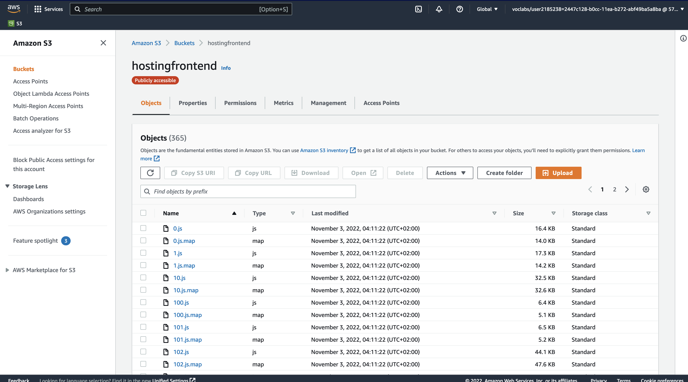
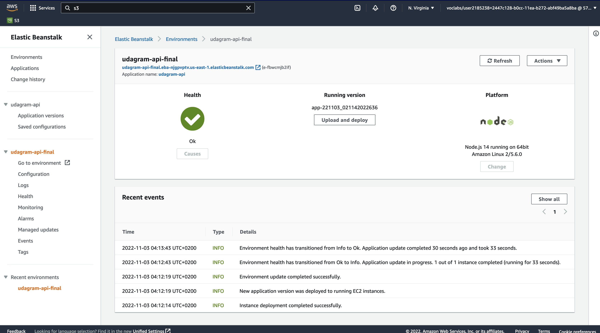
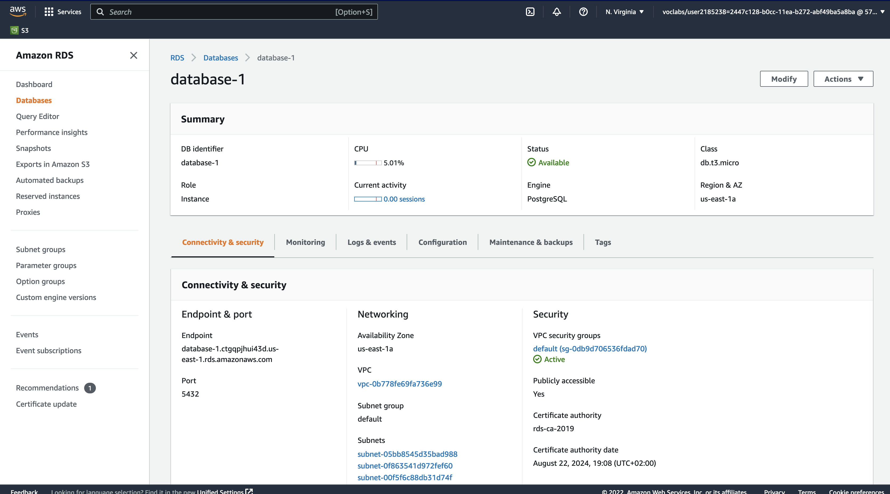
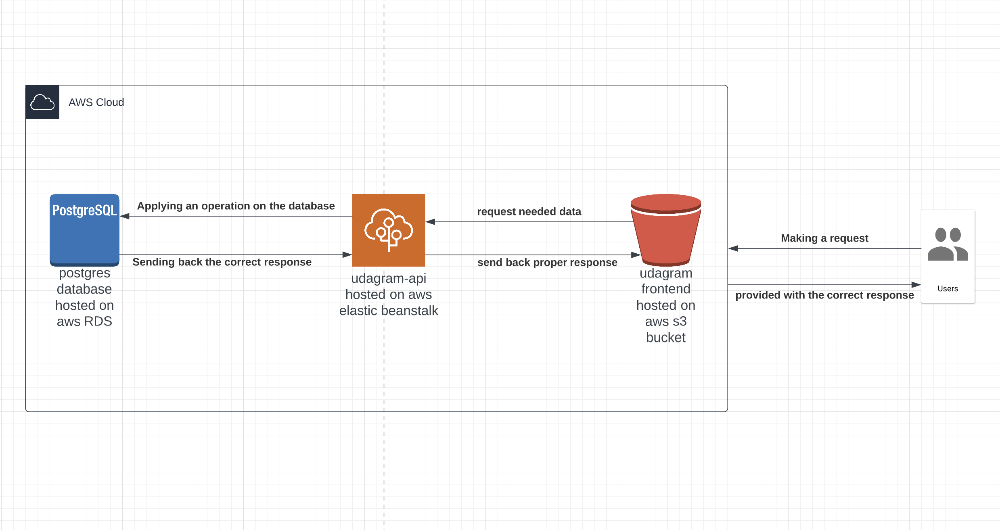

# Infrastructure Architecture

The app includes three main parts :

- Frontend -> hosted on `aws` `s3 bucket` with a public link.

- API -> hosted on `aws` `elasticbeanstalk` instance.

- Database -> postgres instance hosted on `aws` `RDS` service .

In the figure below you can see a diagram illustrating the architecture of the app.

