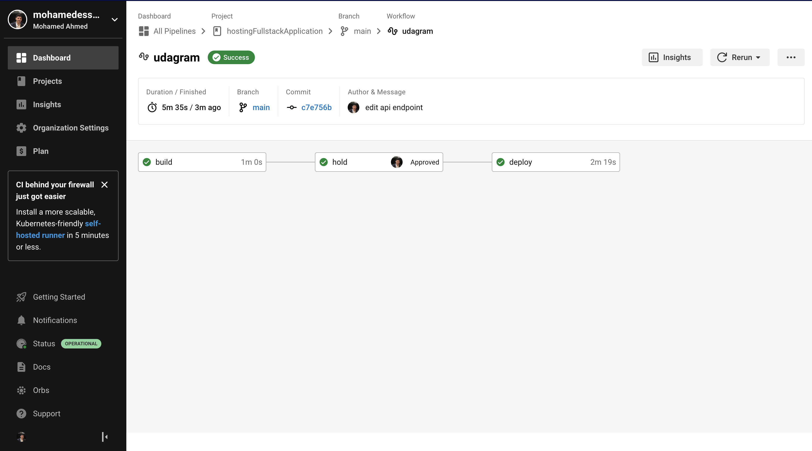

# Pipeline process

The pipeline consists of three main stages which are :

- `build` a stage where both the frontend and the api are built to install required packages and setup proper configurations.

- `hold` a stage which needs manual approve to go to the next stage which is the `deploy` stage.

- `deploy` a stage where both apps frontend and the api are deployed to the correct target for both and with the correct credentials.

In the figure below you can see an overview for the pipeline on circleci.

